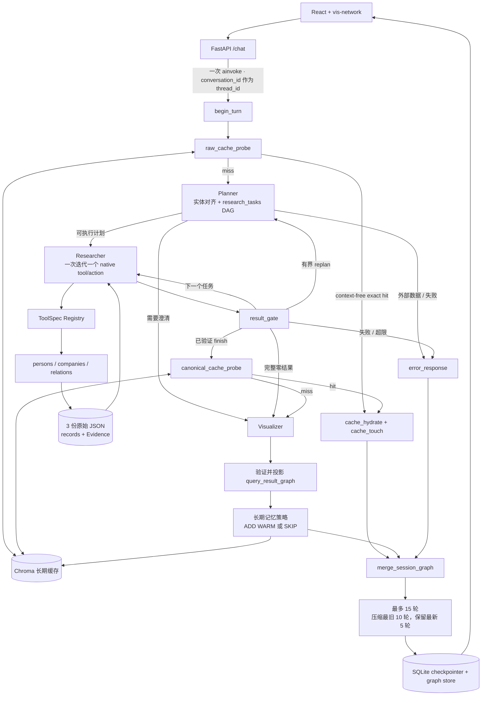

# 企业关系智能探索系统

这是一个可在本地真实运行的多智能体 MVP。公众用户用自然语言查询人物、企业、关系或地点，
系统通过 LangGraph 协调 Planner、Researcher 和 Visualizer，调用本地 mock 数据工具，返回
简洁回答及同一批已验证事实对应的交互式关系图谱，并支持“这些公司在哪？”一类多轮追问。

> 演示声明：所有企业、人物、地点与关系事实仅来自仓库中的本地 mock 数据，不是实时工商
> 信息，也不构成法律控制、所有权、投资或尽调结论。

## 功能范围

- Planner 理解查询、对齐实体名称并生成有依赖关系的研究任务；
- Researcher 使用 OpenAI native tool calling 调用 `persons`、`companies`、`relations`；
- Visualizer 只基于已验证工具记录生成回答，并投影为 `nodes` / `edges` / Evidence；
- LangGraph `StateGraph` 管理 Agent 路由、循环、重规划与完成门；
- SQLite checkpointer 保存最多 15 轮短期会话，Chroma 保存可复用的长期结果；
- React + TypeScript + vis-network 提供聊天、图谱、证据详情与重新布局；
- FastAPI 提供 `/chat`、`/graph`、`/health`、`/ready`；
- Docker Compose 分别运行 frontend、backend 和 Chroma。

生产运行必须配置 OpenAI API Key。测试可通过依赖注入使用 scripted model，但生产环境没有
关键词 Planner、硬编码验收答案、mock LLM 或模型失败后的本地回答降级。

## 唯一事实来源

运行时直接读取且只读取 `data/` 下三份用户原始 JSON：

| 文件 | 数量 | 原始字段 |
|---|---:|---|
| `person 1.json` | 20 | `id/name/nationality/summary` |
| `company 1.json` | 30 | `id/name/legal_rep_id/city/founded_year` |
| `relations 1.json` | 109 | `head/relation/tail` |

后端只在内存中做有类型的无损投影，以生成命名空间 ID、图谱节点/边和 Evidence。每条关系保留
原始 `head/relation/tail`、源文件名和一基行号；重复关系、自关系及原始数据中未解析的端点
不会被静默丢弃。`data/` 中没有别名表、整理后的关系文件或验收答案文件。

实体目录由这三份文件在启动时动态生成，并作为名称候选提供给 Planner。Planner 可以把用户的
中文表达或轻微错别字对齐到目录中的标准名称，但目录不证明企业事实，也不提供稳定 ID；
Researcher 仍必须调用 `persons` 或 `companies` 验证该名称。工具只对原始目录值执行
`exact` / `fuzzy` 检索，不翻译名称，也不制造关系。

## 多智能体任务流

### Planner

Planner 接收当前 query、最近对话、压缩摘要、上轮已验证 focus、动态实体/关系目录，以及三个
工具的能力说明。其结构化输出包含：

- 查询意图；
- `entity_references`：用户原文、预期类型、可选目录标准名和引用来源；
- `research_tasks`：任务目标、工具、主体/客体引用、typed/raw 关系过滤、目标类型和依赖任务；
- `result_merge`：多个任务结果的合并方式；
- 必要时的澄清问题或外部数据标记。

任务是依赖图，不是针对某个问句的后端函数。例如“X 有哪些公司？”在用户没有限定创办、
拥有或任职时，关系任务保留空过滤，表示查询 X 与企业的全部直接业务关系；不能自行缩窄为
`Owns`。多个主体使用同一种任务模型，只是产生多个实体验证任务和后续关系任务，再声明如何
合并结果。

### Researcher

Researcher 每个 StateGraph 迭代只选择一个动作：调用一个事实工具，或发出无参数的
`finish`、`no_results`、`replan`、`fail` 信号。

实体任务先通过 `persons` / `companies` 获得可信 ID；依赖满足后，关系任务才可调用
`relations`。所有关系任务共享同一套参数校验、回执匹配与完成判断。相同工具和规范化参数在
同一轮不会重复执行。运行时代码可验证 ID、Evidence、任务完成度和图谱端点，但不会根据 query
关键词替 Planner 改写意图或制造答案。

每个工具都由通用 `ToolSpec` 定义，包含 name/description、闭合 Pydantic 参数模型、执行
handler、typed result adapter 和 `strict=true` 的 OpenAI function schema；Registry 是唯一
执行入口。`relations` 的公开参数为：

- `subject_ids`
- `object_ids`
- `direction`
- `relation_types`
- `raw_relation_types`
- `include_endpoints`
- `limit`

同一列表内为 OR，不同过滤条件之间为 AND；空关系过滤表示全部直接关系。

### Visualizer

Visualizer 只接收本轮已验证的工具记录，生成本地化答案并选择支持答案的记录 ID。Visualizer
节点再将这些精确记录投影为图谱，运行时验证端点闭合与 Evidence 覆盖。模型不能添加工具未
返回的实体、属性、关系或证据。

API 边的 `label` 和 `properties.raw_relation` 保留原始关系词，前端通过闭合映射显示“创办”、
“担任 CEO”、“总部位于”等中文文案。只有所有相关研究任务都取得成功且完整的零行回执时，
系统才能回答没有结果。

## StateGraph 与双层记忆

FastAPI 对每个 `/chat` 请求只调用一次编译后的 StateGraph。Agent 的先后、循环和重规划由图
节点及条件边控制，不在 API 路由中固定顺序调用。



短期记忆把一条用户消息和最终回答计为一轮。达到边界后，确定性代码压缩最旧 10 轮并保留
最近 5 轮；结构化摘要保存已验证实体、focus、事实/证据 ID 和未完成问题。Prompt、密钥、
隐藏推理和完整模型/工具 payload 不进入 checkpoint。失败或澄清轮不会把旧 focus 记成本轮
结果。

长期缓存只写入研究成功、图谱非空、Evidence 完整、无歧义、非实时且没有模型/工具错误的
当前 `query_result_graph`。首次写入为 WARM；精确复用后晋升 HOT。澄清、失败、零关系、
部分结果和证据不完整均跳过写入。相同的 context-free 原 query 可在 Planner 前 raw exact
命中，因此该次请求的 Planner、Researcher、Visualizer、模型和工具调用数都为 0。

## 目录结构

```text
.
├── backend/
│   ├── app/
│   │   ├── agents/       # StateGraph、三个 Agent、Prompt 与共享 State
│   │   ├── tools/        # ToolSpec、Registry 与原始数据 Repository
│   │   ├── memory/       # SQLite、Chroma、压缩和写入策略
│   │   └── main.py       # FastAPI 入口
│   └── tests/
├── frontend/             # React + TypeScript + vis-network
├── data/                 # 仅三份原始 JSON 与说明文件
├── scripts/
│   └── full_dataset_audit.py
├── docker-compose.yml
└── README.md
```

## Docker 启动

要求 Docker Desktop（或兼容 Docker Engine）与 Docker Compose v2。

1. 创建本地环境文件并限制权限：

   ```bash
   cp .env.example .env
   chmod 600 .env
   ```

2. 在未跟踪的 `.env` 中填写后端使用的 Key：

   ```dotenv
   OPENAI_API_KEY=你的_OpenAI_API_Key
   OPENAI_MODEL=gpt-5.4-mini
   ```

3. 校验、构建并启动三个服务：

   ```bash
   docker compose config --quiet
   docker compose up -d --build
   docker compose ps
   ```

4. 检查后端状态：

   ```bash
   curl -fsS http://localhost:8000/health
   curl -fsS http://localhost:8000/ready
   ```

默认地址：

- Web UI：<http://localhost:3000>
- FastAPI / OpenAPI：<http://localhost:8000> / <http://localhost:8000/docs>
- Chroma heartbeat：<http://localhost:8001/api/v2/heartbeat>

端口默认只绑定 `127.0.0.1`。API Key 只注入 backend runtime，不进入前端、镜像、API 响应、
trace 或日志。空 Key 会让 Compose 显式失败，不会切换为 mock Agent。

## API 示例

### 1. 发起广义企业关系查询

```bash
curl -sS -X POST http://localhost:8000/chat \
  -H 'Content-Type: application/json' \
  -d '{"message":"马云有哪些公司？","locale":"zh-CN"}'
```

响应包含 `conversation_id`、`request_id`、`status`、`answer`、`graph_id`、完整会话 `graph`、
`memory` 和安全 `trace`。这个问题没有限定关系类型，因此 Planner 应规划广义直接关系查询；
原始数据中的 `Founder_of` / `Former_Chairman_of` 等关系可支持马云与阿里巴巴集团的图谱。
与之不同，`马云拥有哪些公司？` 只查询 `Owns`，在原始数据没有匹配行时可以返回工具验证的
空结果。

### 2. 在同一会话中追问地点

把第一轮响应中的 UUID 替换到下方：

```bash
curl -sS -X POST http://localhost:8000/chat \
  -H 'Content-Type: application/json' \
  -d '{
    "conversation_id":"<conversation_id>",
    "message":"这些公司在哪？",
    "locale":"zh-CN"
  }'
```

### 3. 读取会话图谱或固定图谱快照

`GET /graph` 必须且只能提供一个参数：

```bash
curl -sS 'http://localhost:8000/graph?conversation_id=<conversation_id>'
curl -sS 'http://localhost:8000/graph?graph_id=<graph_id>'
```

### 4. 验证长期缓存

再次发送与第一轮完全相同、且不依赖会话上下文的 query。有效命中应显示：

```json
{
  "memory": {
    "cache_hit": true,
    "match_type": "raw_exact",
    "status": "hot"
  },
  "trace": {
    "model_calls": 0,
    "planner_model_calls": 0,
    "researcher_model_calls": 0,
    "visualizer_model_calls": 0,
    "researcher_invoked": false,
    "tool_calls": 0
  }
}
```

`查马斯克控制的公司` 的回答只能展示原始数据实际支持的创办、任职或持有关系，并明确它们
不等于法律控制；系统不会把这些边改写成虚构的 `controls`。

## 测试

### 后端（默认不需要 API Key）

测试通过显式依赖注入使用 scripted model：

```bash
cd backend
uv sync --extra test
uv run pytest -m 'not live'
```

只运行从原始 JSON 派生的矩阵测试：

```bash
cd backend
uv run pytest tests/unit/test_raw_dataset_matrix.py
```

该矩阵在测试运行时读取三份原始文件，覆盖人物、企业、地点、109 条关系的 provenance、重复/
自关系、单主体与多主体预期；生产代码中不硬编码人物、公司、关系 ID 或验收答案。

### Chroma 集成与持久化

```bash
OPENAI_API_KEY=scripted-test-only docker compose up -d chroma
cd backend
RUN_CHROMA_INTEGRATION=1 uv run pytest -m 'integration and not live'
```

### 前端测试与生产构建

```bash
cd frontend
npm ci
npm test
npm run build
```

### 全数据 HTTP 审计（真实 OpenAI，会产生费用）

`scripts/full_dataset_audit.py` 完全从原始 JSON 推导请求和期望图谱，不导入后端代码，也不读取
API Key。默认模式只输出计划，网络请求数为 0：

```bash
python3 scripts/full_dataset_audit.py
```

当前完整计划包含 137 个数据派生用例：20 个人物广义关系、30 个企业关系、30 个地点和 57
个可解析主体—客体关系对。先对已启动的 Docker 服务运行小样本：

```bash
python3 scripts/full_dataset_audit.py --execute \
  --max-persons 3 --max-companies 3 --max-locations 3 --max-pairs 5 \
  --report output/full-dataset-audit-sample.json
```

确认费用与运行时间后再执行全量：

```bash
python3 scripts/full_dataset_audit.py --execute --concurrency 2 \
  --report output/full-dataset-audit.json
```

审计校验结构化节点、边、原始行号、Evidence、工具 trace 与缓存不变量，不依赖模型回答逐字
一致。`--execute` 是显式付费开关；省略它不会调用 Docker HTTP API 或 OpenAI。

## 日志与排查

```bash
docker compose logs --tail=200 backend
docker compose logs -f backend
```

Fresh path 日志可通过 `request_id` 和 `conversation_id` 关联 Planner 计划摘要、Researcher 动作、
工具结果、Visualizer 选择与最终计数。日志只记录 typed action、工具名、安全记录 ID、参数
指纹、状态和稳定错误码，不记录完整 query、Prompt、模型 payload、实体属性、隐藏推理或 Key。

判断缓存命中应以 `/chat` 的 `memory` 和 `trace` 为准，而不是仅根据响应时间。Chroma 读取
故障会作为 cache miss 处理；OpenAI 调用失败会安全失败，不会切换到本地规则回答。

## 主要环境变量

| 变量 | 默认值 | 说明 |
|---|---:|---|
| `OPENAI_API_KEY` | 空 | Docker 生产运行必填，仅注入 backend |
| `OPENAI_MODEL` | `gpt-5.4-mini` | OpenAI 模型名 |
| `OPENAI_TIMEOUT_SECONDS` | `45` | 单次模型调用超时 |
| `MAX_RESEARCH_STEPS` | `12` | Researcher 动作预算 |
| `MAX_TOOL_CALLS` | `10` | 当前轮事实工具调用上限 |
| `MAX_REPLANS` | `2` | 有界重规划上限 |
| `SHORT_TERM_MAX_TURNS` | `15` | 原始可见会话轮数上限 |
| `CACHE_TTL_HOURS` | `24` | 长期缓存固定 TTL |
| `CHROMA_COLLECTION_PREFIX` | `enterprise_query_cache_v18` | 当前 task-DAG 语义的缓存 namespace |
| `QUERY_SIGNATURE_VERSION` | `4` | 当前 canonical query signature 版本 |

运行时默认不传 `temperature`。

## 停止与清理

保留 Chroma 与 SQLite 数据停止服务：

```bash
docker compose down
```

删除服务并清除本地演示缓存与会话卷：

```bash
docker compose down -v
```

`down -v` 会不可恢复地删除 Compose 命名卷中的本地演示状态。`.env` 已被 Git 和 Docker build
context 忽略；若 Key 曾出现在不可信日志或提交中，请立即在 OpenAI 控制台撤销并更换。

## MVP 不包含

本项目不包含实时注册表、Web 搜索、爬虫、新闻、股价、法律控制权判断、股权穿透、登录、
计费、多租户、Neo4j、Redis、Postgres 或云端发布。三份原始 mock 数据无法验证的企业事实
必须澄清、返回工具验证的空结果或安全失败，不能让模型用常识补齐。
