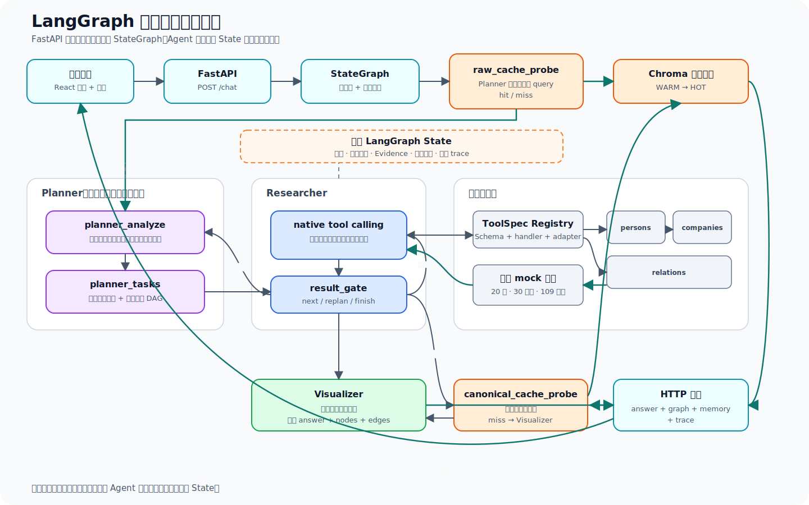
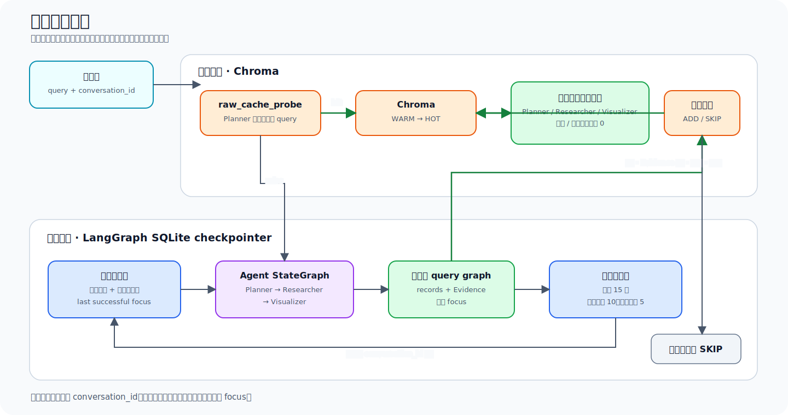

# 企业关系智能探索系统

面向公众的企业关系探索 MVP。用户用自然语言查询人物、企业、关系或地点，系统通过
LangGraph 协调 Planner、Researcher、Visualizer，调用本地 mock 数据工具，返回文字回答和
前端可渲染的企业—人物—地点图谱，并支持多轮追问。

事实只来自 `data/person 1.json`、`data/company 1.json`、`data/relations 1.json`；系统不把
模型常识当作企业事实。

## Agent 协作架构



三个 Agent 通过同一个共享 State 通信，而不是由 API 路由硬编码顺序调用：

- Planner 输出结构化实体引用、研究目标和任务依赖，不生成事实 ID。
- Researcher 从 State 读取 Planner 计划，通过 OpenAI native tool calling 调用
  `persons`、`companies`、`relations`，并把回执和 Evidence 写回 State。
- Visualizer 只读取本轮已验证记录，生成回答并投影为 `nodes` / `edges`；不能添加工具未返回
  的实体或关系。

## 双层记忆流向



- 短期记忆由 LangGraph SQLite checkpointer 保存，最多保留 15 轮可见上下文；失败或澄清不会
  覆盖最后一次成功 focus，因此“这些公司在哪？”可以引用上一轮完整企业集合。
- 长期记忆由 Chroma 保存通过验证的高价值结果。首次写入为 WARM，精确复用后晋升 HOT；相同
  context-free query 可在 Planner 前命中。
- 依赖会话上下文的缓存与当前 `conversation_id` 隔离，避免不同会话串答。

## Docker Compose 启动

要求本机已安装 Docker Desktop（或兼容 Docker Engine）和 Docker Compose。

```bash
cd '/path/to/search agent'
test -f .env || cp .env.example .env
chmod 600 .env
```

首次启动时编辑 `.env`，至少填写：

```dotenv
OPENAI_API_KEY=你的_OpenAI_API_Key
OPENAI_MODEL=gpt-5.4-mini
```

校验并启动 frontend、backend、chroma 三个服务：

```bash
docker compose config --quiet
docker compose up -d --build
docker compose ps
```

若本机安装了兼容当前 Compose Spec 的独立 `docker-compose`，也可以使用：

```bash
docker-compose up -d --build
```

默认服务地址（修改 `.env` 中的宿主机端口后，请同步替换下列 URL）：

- Web UI：<http://localhost:3000>
- FastAPI 文档：<http://localhost:8000/docs>
- Chroma 健康端点：<http://localhost:8001/api/v2/heartbeat>

健康检查：

```bash
curl -fsS http://localhost:8000/health
curl -fsS http://localhost:8000/ready
```

停止服务：

```bash
docker compose down
```

## API 调用示例

### 1. 首轮查询

```bash
curl -sS -X POST http://localhost:8000/chat \
  -H 'Content-Type: application/json' \
  -d '{
    "message":"查马斯克控制的公司",
    "locale":"zh-CN"
  }'
```

响应包含 `conversation_id`、`request_id`、`answer`、`graph_id`、`graph`、`memory` 和安全
`trace`。请保存响应中的 `conversation_id` 供下一轮使用。

### 2. 同一会话追问地点

```bash
curl -sS -X POST http://localhost:8000/chat \
  -H 'Content-Type: application/json' \
  -d '{
    "conversation_id":"<conversation_id>",
    "message":"这些公司在哪？",
    "locale":"zh-CN"
  }'
```

### 3. 重复首问验证长期缓存

```bash
curl -sS -X POST http://localhost:8000/chat \
  -H 'Content-Type: application/json' \
  -d '{
    "message":"查马斯克控制的公司",
    "locale":"zh-CN"
  }'
```

缓存命中时，响应中的 `memory.cache_hit` 为 `true`、`memory.match_type` 为 `raw_exact`，并且
`trace` 中 Planner、Researcher、Visualizer、模型和工具调用数均为 `0`。

### 4. 获取图谱

`GET /graph` 必须提供且只能提供一个查询参数：

```bash
curl -sS 'http://localhost:8000/graph?conversation_id=<conversation_id>'
curl -sS 'http://localhost:8000/graph?graph_id=<graph_id>'
```
