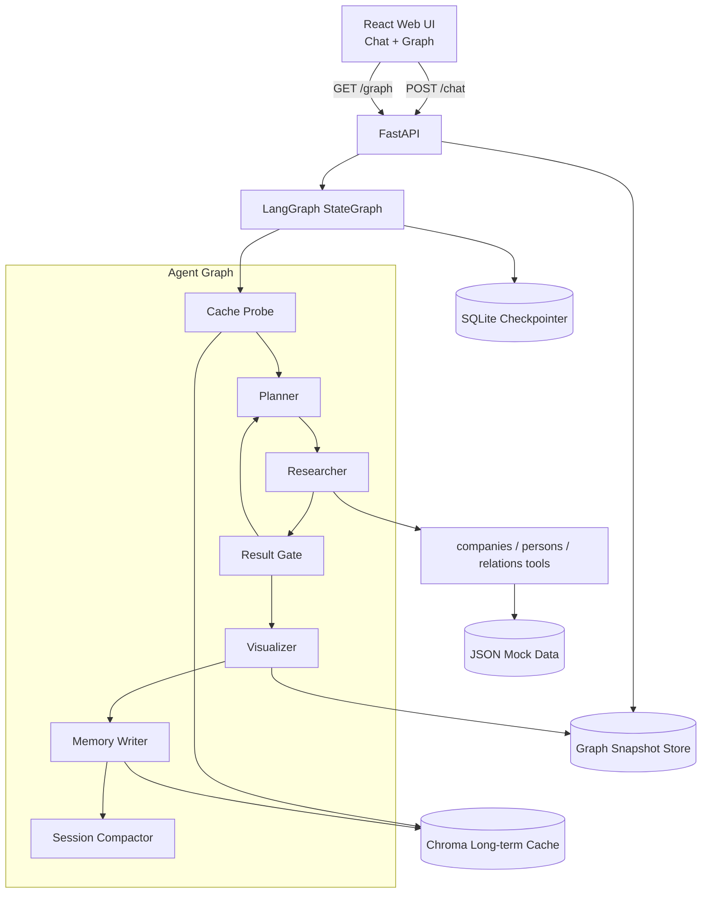
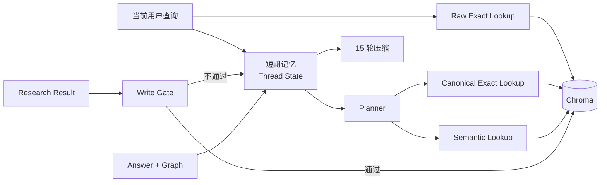
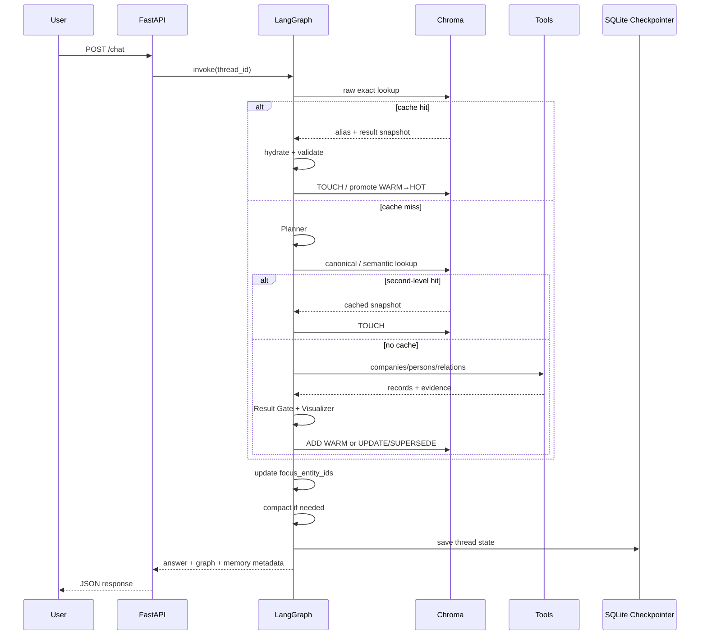

# 企业关系智能探索系统：MVP 完整设计方案

> 重点：多智能体协作、双层记忆、长期记忆写入策略、缓存命中与失效、可视化图谱、接口与测试验收

| 文档项 | 内容 |
|---|---|
| 项目名称 | 企业关系智能探索系统（Enterprise Relationship Intelligence Explorer） |
| 文档类型 | MVP 技术设计方案 |
| 目标读者 | 后端工程师、Agent 工程师、前端工程师、测试与评审人员 |
| 设计基线日期 | 2026-07-17 |
| 推荐技术栈 | FastAPI、LangGraph、Chroma、SQLite、React、TypeScript、vis-network、Docker Compose |

---

## 1. 项目目标

构建一个面向公众的企业关系智能探索系统。用户通过自然语言提出问题，例如：

```text
特斯拉和马斯克有哪些关联公司？
```

系统通过多个 Agent 协作，查询公开或模拟的企业、人物与关系数据，生成自然语言回答和前端可渲染的企业—人物关联图谱，并支持基于当前图谱进行多轮追问。

MVP 必须完成以下能力：

1. 至少包含 `Planner`、`Researcher`、`Visualizer` 三个 Agent。
2. 使用 LangGraph 或同类状态机实现共享状态、条件分支和循环，不能在接口层硬编码固定顺序。
3. FastAPI 提供 `/chat` 与 `/graph` 接口。
4. React 或 Vue 提供聊天界面和图谱界面。
5. 图谱使用 D3.js 或 vis-network 渲染。
6. 短期记忆最多保留 15 个完整用户回合，并支持上下文压缩。
7. 长期记忆使用 Chroma 保存经过验证的高价值查询结果。
8. 第一次查询“查马斯克控制的公司”时返回 Tesla、SpaceX 等节点。
9. 追问“这些公司在哪？”时正确解析“这些公司”，返回所在地并更新图谱。
10. 第三个用户回合再次问“查马斯克控制的公司”时，直接从长期记忆命中，日志体现 `cache hit`，并跳过 Researcher 工具查询。

---

## 2. MVP 范围与非目标

### 2.1 MVP 范围

MVP 聚焦于可运行、可测试、可解释，不追求一次性完成完整商业知识图谱平台。

包含：

- 人物、企业、地点三类核心节点；
- 控制、任职、创办、投资、股东、总部位于等基础关系；
- 本地 JSON 模拟数据；
- 可替换的工具接口；
- 多轮指代解析；
- 精确缓存与受约束的语义缓存；
- 缓存版本、TTL、证据指纹和日志；
- Docker Compose 一键启动。

### 2.2 暂不纳入 MVP

- 大规模实时工商数据抓取；
- Neo4j 等专用图数据库；
- 自动网页爬虫与复杂反爬处理；
- 复杂股权穿透计算；
- 跨语言实体对齐平台；
- 用户私有知识库；
- 完整权限控制、计费与多租户隔离；
- 后台异步记忆整理服务；
- 让 LLM 自主修改长期事实；
- 将完整聊天记录全部写入向量库。

---

## 3. 核心设计结论

本项目的记忆系统建议采用以下模式：

> **短期记忆保存会话上下文、当前关注实体和图谱焦点；长期记忆保存经过验证、带来源、带版本的查询结果快照。所有长期写入均由确定性的 Memory Policy 节点控制。**

关键原则：

1. **第一次成功查询立即写入长期记忆，但状态为 `WARM`。**
2. `WARM` 结果只允许原始查询精确命中或规范化查询精确命中。
3. 第一次被缓存复用后升级为 `HOT`。
4. 只有 `HOT` 结果允许语义相似查询命中。
5. 查询结果不完整、实体有歧义、工具失败或缺少证据时禁止写入。
6. 企业关系变化时不直接覆盖历史事实，而是创建新快照，并把旧快照标记为 `SUPERSEDED`。
7. 数据文件、图谱 Schema、Embedding 模型或权限范围变化时，旧缓存自动失效。
8. “这些公司”等指代必须先解析为稳定实体 ID，再参与缓存键计算。

该策略兼顾了三个目标：

- 首次成功查询后，第三个用户回合能够立即精确命中；
- 一次偶然查询不会立刻向所有相似问法开放语义命中；
- 企业事实能够保留来源、版本和历史状态。

---

## 4. 相关项目与论文调研结论

### 4.1 LangGraph

LangGraph 将持久化分为两类：

- Checkpointer：线程级图状态，适合短期会话记忆；
- Store：跨线程、应用级持久数据，适合长期事实和共享知识。

本项目采用这一分层思想：

- 短期会话状态由 LangGraph checkpointer 保存；
- 长期查询结果由 Chroma 保存；
- Agent 之间通过共享 State 通信。

参考：

- [LangGraph Persistence](https://docs.langchain.com/oss/python/langgraph/persistence)
- [LangChain Short-term Memory](https://docs.langchain.com/oss/python/langchain/short-term-memory)
- [LangGraph GitHub](https://github.com/langchain-ai/langgraph)

### 4.2 MemGPT / Letta

MemGPT 以操作系统虚拟内存为类比，将有限上下文视为快速工作记忆，把较大信息放入外部记忆并按需调入。

本项目采用其层次化思想，但不让 LLM 自由决定企业事实的持久化：

- 当前图谱焦点保留在短期状态；
- 历史查询结果不持续占用 Prompt；
- 只有缓存命中或查询需要时才调入长期结果。

参考：

- [MemGPT: Towards LLMs as Operating Systems](https://arxiv.org/abs/2310.08560)

### 4.3 Mem0

Mem0 的更新阶段将新记忆与已有记忆比较，并使用 `ADD / UPDATE / DELETE / NOOP` 分类管理长期记忆。

本项目借用“写入前先比较”的思想，但做两项调整：

1. 不使用 LLM 决定企业事实是否写入，而采用确定性质量门禁；
2. 将破坏性 `DELETE` 替换为更适合企业关系的 `SUPERSEDE` 和 `STALE`。

参考：

- [Mem0: Building Production-Ready AI Agents with Scalable Long-Term Memory](https://arxiv.org/abs/2504.19413)

### 4.4 GPTCache

GPTCache 说明了仅依赖精确字符串缓存会导致自然语言改写场景命中率较低，因此使用 Embedding 和向量相似度实现语义缓存。同时，语义缓存存在误命中风险，需要评估阈值和过滤条件。

本项目采用三级读取：

1. 原始查询精确键；
2. 规范化意图精确键；
3. 仅对 `HOT` 记录执行带元数据过滤的语义检索。

参考：

- [GPTCache GitHub](https://github.com/zilliztech/GPTCache)

### 4.5 Graphiti / Zep

Graphiti 使用时间化上下文图，保留事实有效时间、历史关系和来源，不因新事实出现而直接删除旧事实。

本项目不在 MVP 中引入 Neo4j 或 Graphiti，但采用其关键数据原则：

- 关系带 `valid_from`、`valid_to`；
- 每条关系能够追溯到来源；
- 新事实冲突时，旧快照失效但保留历史；
- 使用 `SUPERSEDED` 而不是覆盖删除。

参考：

- [Graphiti GitHub](https://github.com/getzep/graphiti)
- [Zep: A Temporal Knowledge Graph Architecture for Agent Memory](https://arxiv.org/abs/2501.13956)

### 4.6 Generative Agents

Generative Agents 的记忆检索结合相关性、近期性和重要性。MVP 不需要额外引入 LLM 重要性打分，但可使用确定性指标替代：

- `hit_count`；
- `last_accessed_at`；
- `status`；
- `expires_at`；
- 证据完整度；
- 数据版本。

参考：

- [Generative Agents: Interactive Simulacra of Human Behavior](https://arxiv.org/abs/2304.03442)

### 4.7 调研后的工程取舍

MVP 不建议同时引入 Mem0、LangMem、Graphiti、Neo4j 和独立语义缓存框架。推荐：

- 使用 LangGraph 负责状态机和短期状态；
- 使用 Chroma 负责长期结果缓存；
- 自行实现一个小型、确定性的 `MemoryPolicy`；
- 将企业图谱作为结构化结果，而不是把所有关系交给通用记忆框架管理。

这样可以减少部署组件、隐式行为和调试成本。

---

## 5. 总体系统架构



### 5.1 组件职责

| 组件 | 职责 |
|---|---|
| React UI | 发送消息、显示回答、渲染 nodes/edges、保持 conversation_id |
| FastAPI | 请求校验、调用 LangGraph、提供图谱读取、健康检查和错误映射 |
| LangGraph | Agent 编排、共享状态、条件路由、重规划、缓存旁路 |
| Planner | 解析意图、消解实体、生成规范化查询签名、拆解子任务 |
| Researcher | 调用企业、人物、关系工具，积累证据和结构化结果 |
| Result Gate | 检查完整性、歧义、工具错误、证据覆盖率和是否需要重规划 |
| Visualizer | 生成自然语言回答和统一 graph schema |
| Memory Writer | 根据确定性策略执行 ADD、TOUCH、UPDATE、SUPERSEDE 或 SKIP |
| Session Compactor | 控制 15 轮上限并生成结构化摘要 |
| Chroma | 长期查询别名、向量索引和结果快照 |
| SQLite Checkpointer | 当前会话线程状态持久化 |

---

## 6. 多智能体 StateGraph 设计

### 6.1 禁止固定顺序调用

错误方式：

```python
plan = planner(query)
research = researcher(plan)
graph = visualizer(research)
```

这种写法只是普通函数流水线，无法根据共享状态进行缓存旁路、重规划、循环研究或错误恢复。

正确方式：

- 每个 Agent 是图节点；
- 节点读取并更新同一份 `AgentState`；
- 使用条件边决定下一个节点；
- Researcher 可以根据 `pending_tasks` 循环；
- Result Gate 可以回到 Planner；
- 缓存命中可以跳过 Researcher；
- 记忆写入和压缩也是图节点。

### 6.2 推荐节点

```text
START
  ↓
load_session
  ↓
raw_cache_probe
  ├─ raw exact hit → cache_hydrate → visualizer
  └─ miss → planner
                 ↓
          canonical_cache_probe
             ├─ exact/semantic hit → cache_hydrate → visualizer
             └─ miss → researcher
                          ↓
                     result_gate
                 ├─ more tasks → researcher
                 ├─ replan → planner
                 ├─ fatal error → error_response
                 └─ valid → visualizer
                                  ↓
                             memory_policy
                                  ↓
                           compact_session
                                  ↓
                                 END
```

### 6.3 条件边

| 来源节点 | 条件 | 目标节点 |
|---|---|---|
| `raw_cache_probe` | `cache.hit == true` | `cache_hydrate` |
| `raw_cache_probe` | `cache.hit == false` | `planner` |
| `canonical_cache_probe` | 有有效缓存 | `cache_hydrate` |
| `canonical_cache_probe` | 无有效缓存 | `researcher` |
| `researcher` | 工具返回且任务未结束 | `result_gate` |
| `result_gate` | `pending_tasks` 非空 | `researcher` |
| `result_gate` | `needs_replan == true` | `planner` |
| `result_gate` | `result_valid == true` | `visualizer` |
| `result_gate` | 不可恢复错误 | `error_response` |
| `visualizer` | 始终 | `memory_policy` |
| `memory_policy` | 始终 | `compact_session` |

### 6.4 Agent 角色定义

#### Planner

输入：

- 用户当前查询；
- 最近原始消息；
- 会话摘要；
- `focus_entity_ids`；
- `last_graph_node_ids`；
- 实体别名表。

输出：

- `intent`；
- `resolved_entities`；
- `query_signature`；
- `plan`；
- `pending_tasks`；
- `requires_realtime_data`；
- `needs_clarification`。

示例：

```json
{
  "intent": "find_controlled_companies",
  "resolved_entities": {
    "马斯克": "person:elon_musk"
  },
  "query_signature": {
    "intent": "find_controlled_companies",
    "subject_ids": ["person:elon_musk"],
    "relation_types": ["controls"],
    "target_types": ["company"],
    "requested_attributes": [],
    "context_entity_ids": [],
    "locale": "zh-CN"
  },
  "pending_tasks": [
    {
      "task_id": "t1",
      "tool": "relations",
      "arguments": {
        "source_id": "person:elon_musk",
        "relation_types": ["controls"]
      }
    },
    {
      "task_id": "t2",
      "tool": "companies",
      "depends_on": ["t1"]
    }
  ]
}
```

#### Researcher

职责：

- 从 `pending_tasks` 选择当前可执行任务；
- 调用 `companies`、`persons`、`relations`；
- 不直接生成最终自然语言回答；
- 将工具结果标准化为节点、关系和 evidence；
- 记录工具延迟、错误和来源版本；
- 对依赖任务进行迭代执行。

#### Visualizer

职责：

- 根据已验证的研究结果生成 `answer`；
- 输出统一 `nodes/edges`；
- 合并当前图谱和上一轮图谱；
- 保持节点 ID 稳定；
- 添加地点节点或地点属性；
- 不修改工具事实；
- 不负责决定是否写入长期记忆。

### 6.5 共享状态定义

```python
from typing import Annotated, Literal, TypedDict
from langgraph.graph.message import add_messages


class AgentState(TypedDict, total=False):
    # 会话与输入
    conversation_id: str
    request_id: str
    user_id: str | None
    locale: str
    messages: Annotated[list, add_messages]
    raw_turn_count: int
    conversation_summary: str

    # 指代与图谱焦点
    resolved_entities: dict[str, str]
    focus_entity_ids: list[str]
    last_graph_id: str | None
    last_graph_node_ids: list[str]

    # Planner
    intent: str | None
    query_signature: dict | None
    raw_cache_key: str | None
    canonical_cache_key: str | None
    scope_hash: str | None
    plan: list[dict]
    pending_tasks: list[dict]
    completed_tasks: list[dict]
    needs_replan: bool
    needs_clarification: bool
    query_requires_realtime_data: bool

    # Researcher
    tool_evidence: list[dict]
    tool_errors: list[dict]
    research_nodes: list[dict]
    research_edges: list[dict]

    # 验证
    run_status: Literal["running", "success", "partial", "failed"]
    graph_schema_valid: bool
    evidence_coverage: float
    has_ambiguous_entities: bool
    result_valid: bool

    # Cache
    cache: dict

    # 最终输出
    answer: str | None
    graph: dict | None
    graph_id: str | None

    # Memory
    memory_decision: dict | None
    memory_write_error: str | None
```

### 6.6 LangGraph 骨架示意

```python
from langgraph.graph import END, START, StateGraph

builder = StateGraph(AgentState)

builder.add_node("load_session", load_session)
builder.add_node("raw_cache_probe", raw_cache_probe)
builder.add_node("planner", planner_node)
builder.add_node("canonical_cache_probe", canonical_cache_probe)
builder.add_node("researcher", researcher_node)
builder.add_node("result_gate", result_gate)
builder.add_node("cache_hydrate", cache_hydrate)
builder.add_node("visualizer", visualizer_node)
builder.add_node("memory_policy", memory_policy_node)
builder.add_node("compact_session", compact_session_node)
builder.add_node("error_response", error_response_node)

builder.add_edge(START, "load_session")
builder.add_edge("load_session", "raw_cache_probe")

builder.add_conditional_edges(
    "raw_cache_probe",
    lambda s: "hit" if s["cache"]["hit"] else "miss",
    {"hit": "cache_hydrate", "miss": "planner"},
)

builder.add_edge("planner", "canonical_cache_probe")

builder.add_conditional_edges(
    "canonical_cache_probe",
    route_canonical_cache,
    {
        "hit": "cache_hydrate",
        "miss": "researcher",
        "clarify": "visualizer",
    },
)

builder.add_edge("researcher", "result_gate")

builder.add_conditional_edges(
    "result_gate",
    route_after_validation,
    {
        "research": "researcher",
        "replan": "planner",
        "valid": "visualizer",
        "error": "error_response",
    },
)

builder.add_edge("cache_hydrate", "visualizer")
builder.add_edge("visualizer", "memory_policy")
builder.add_edge("error_response", "compact_session")
builder.add_edge("memory_policy", "compact_session")
builder.add_edge("compact_session", END)

graph = builder.compile(checkpointer=checkpointer)
```

---

## 7. 工具层设计

### 7.1 工具接口

MVP 提供三个工具：

```python
async def search_companies(
    ids: list[str] | None = None,
    names: list[str] | None = None,
    attributes: list[str] | None = None,
) -> ToolResult:
    ...


async def search_persons(
    ids: list[str] | None = None,
    names: list[str] | None = None,
    attributes: list[str] | None = None,
) -> ToolResult:
    ...


async def search_relations(
    source_ids: list[str] | None = None,
    target_ids: list[str] | None = None,
    relation_types: list[str] | None = None,
) -> ToolResult:
    ...
```

### 7.2 ToolResult

```python
class ToolResult(BaseModel):
    success: bool
    provider: str
    data_version: str
    records: list[dict]
    evidence: list[dict]
    elapsed_ms: int
    error_code: str | None = None
    error_message: str | None = None
```

### 7.3 稳定 ID 规则

```text
person:elon_musk
company:tesla
company:spacex
location:austin_tx_us
location:hawthorne_ca_us
relation:elon_musk-controls-tesla
```

实体显示名可以变化，但 ID 不应随语言或大小写变化。

### 7.4 关系枚举

```python
RelationType = Literal[
    "controls",
    "founded",
    "works_at",
    "board_member_of",
    "invested_in",
    "shareholder_of",
    "subsidiary_of",
    "partner_of",
    "headquartered_in",
]
```

### 7.5 模拟数据结构

`data/persons.json`：

```json
[
  {
    "id": "person:elon_musk",
    "name": "Elon Musk",
    "aliases": ["马斯克", "埃隆·马斯克", "Elon Musk"],
    "type": "person",
    "source": "mock-public-data",
    "updated_at": "2026-07-01T00:00:00Z"
  }
]
```

`data/companies.json`：

```json
[
  {
    "id": "company:tesla",
    "name": "Tesla",
    "aliases": ["特斯拉", "Tesla, Inc."],
    "type": "company",
    "headquarters_id": "location:austin_tx_us",
    "source": "mock-public-data",
    "updated_at": "2026-07-01T00:00:00Z"
  },
  {
    "id": "company:spacex",
    "name": "SpaceX",
    "aliases": ["SpaceX", "太空探索技术公司"],
    "type": "company",
    "headquarters_id": "location:hawthorne_ca_us",
    "source": "mock-public-data",
    "updated_at": "2026-07-01T00:00:00Z"
  }
]
```

`data/relations.json`：

```json
[
  {
    "id": "relation:elon_musk-controls-tesla",
    "source_id": "person:elon_musk",
    "target_id": "company:tesla",
    "type": "controls",
    "valid_from": "2008-10-01",
    "valid_to": null,
    "source": "mock-public-data",
    "updated_at": "2026-07-01T00:00:00Z"
  },
  {
    "id": "relation:elon_musk-controls-spacex",
    "source_id": "person:elon_musk",
    "target_id": "company:spacex",
    "type": "controls",
    "valid_from": "2002-05-06",
    "valid_to": null,
    "source": "mock-public-data",
    "updated_at": "2026-07-01T00:00:00Z"
  }
]
```

以上数据是 MVP 测试数据，不应被表述为实时工商结论。

---

## 8. 前端图谱数据结构

### 8.1 GraphResponse

```python
class GraphNode(BaseModel):
    id: str
    type: Literal["person", "company", "location"]
    label: str
    properties: dict = {}
    evidence_ids: list[str] = []


class GraphEdge(BaseModel):
    id: str
    source: str
    target: str
    type: str
    label: str
    properties: dict = {}
    evidence_ids: list[str] = []


class GraphPayload(BaseModel):
    graph_id: str
    nodes: list[GraphNode]
    edges: list[GraphEdge]
    generated_at: str
    data_version: str
```

### 8.2 示例

```json
{
  "graph_id": "graph:01JXYZ",
  "nodes": [
    {
      "id": "person:elon_musk",
      "type": "person",
      "label": "Elon Musk",
      "properties": {}
    },
    {
      "id": "company:tesla",
      "type": "company",
      "label": "Tesla",
      "properties": {}
    },
    {
      "id": "company:spacex",
      "type": "company",
      "label": "SpaceX",
      "properties": {}
    }
  ],
  "edges": [
    {
      "id": "relation:elon_musk-controls-tesla",
      "source": "person:elon_musk",
      "target": "company:tesla",
      "type": "controls",
      "label": "控制"
    },
    {
      "id": "relation:elon_musk-controls-spacex",
      "source": "person:elon_musk",
      "target": "company:spacex",
      "type": "controls",
      "label": "控制"
    }
  ],
  "generated_at": "2026-07-17T10:00:00Z",
  "data_version": "mock-v1"
}
```

### 8.3 图谱合并规则

多轮追问时，不创建重复节点：

```python
def merge_graph(old: GraphPayload | None, new: GraphPayload) -> GraphPayload:
    nodes = {node.id: node for node in (old.nodes if old else [])}
    edges = {edge.id: edge for edge in (old.edges if old else [])}

    for node in new.nodes:
        nodes[node.id] = merge_node(nodes.get(node.id), node)

    for edge in new.edges:
        edges[edge.id] = edge

    return GraphPayload(
        graph_id=new.graph_id,
        nodes=list(nodes.values()),
        edges=list(edges.values()),
        generated_at=new.generated_at,
        data_version=new.data_version,
    )
```

地点可表现为独立节点：

```text
company:tesla --headquartered_in--> location:austin_tx_us
```

这种方式比只在公司 properties 中写字符串更适合图谱可视化和后续地点追问。

---

# 9. 双层记忆总体设计



### 9.1 短期记忆

用途：

- 当前会话连续性；
- 最近消息；
- 会话摘要；
- 指代解析；
- 当前关注实体；
- Agent 计划与任务状态；
- 最近图谱 ID；
- 缓存命中信息。

作用范围：单个 `conversation_id`。

推荐存储：SQLite checkpointer。

### 9.2 长期记忆

用途：

- 跨会话复用公共查询结果；
- 保存规范化查询和结果快照；
- 支持精确和语义检索；
- 记录命中次数、状态、版本、TTL 和来源指纹。

作用范围：应用级公共数据缓存；未来可按权限范围隔离。

推荐存储：Chroma Server。

### 9.3 长期记忆不是聊天记录仓库

不应把完整聊天消息全部写入 Chroma。长期记忆只保存：

- 已验证的查询签名；
- 最终回答；
- 结构化图谱；
- 来源证据；
- 版本和有效期；
- 缓存统计。

---

# 10. 短期记忆设计

## 10.1 保存内容

```python
class SessionMemory(BaseModel):
    conversation_id: str
    messages: list[dict]
    raw_turn_count: int
    conversation_summary: str

    resolved_entities: dict[str, str]
    focus_entity_ids: list[str]
    last_graph_id: str | None
    last_graph_node_ids: list[str]

    last_intent: str | None
    last_query_signature: dict | None
    updated_at: datetime
```

最重要的结构化字段：

```text
focus_entity_ids
last_graph_node_ids
resolved_entities
```

第二轮“这些公司在哪？”应解析为：

```json
{
  "这些公司": [
    "company:tesla",
    "company:spacex"
  ]
}
```

不能只依赖摘要中的自然语言，因为摘要可能遗漏、改写或混淆实体集合。

## 10.2 回合定义

一个完整回合定义为：

```text
一条用户消息 + 一次最终 Assistant 响应
```

以下内容不计入 15 轮：

- Planner 内部消息；
- 工具调用；
- 工具返回；
- Researcher 重试；
- Visualizer 中间输出。

## 10.3 写入时机

每个完整用户回合结束后：

```text
生成 answer 和 graph
→ 更新 focus_entity_ids
→ 更新 last_graph_id
→ 更新最近消息
→ 检查是否压缩
→ 通过 checkpointer 保存状态
→ 返回 HTTP 响应
```

## 10.4 压缩触发条件

```python
should_compact = (
    raw_turn_count >= 15
    or estimated_context_tokens >= settings.short_term_token_trigger
)
```

推荐初始值：

```yaml
max_raw_turns: 15
token_trigger: 6000
compact_oldest_turns: 10
keep_recent_turns: 5
summary_max_tokens: 800
```

## 10.5 压缩算法

当原始会话达到 15 轮：

1. 读取最旧的 10 轮；
2. 将其与已有 `conversation_summary` 合并摘要；
3. 保留最近 5 轮原始消息；
4. 保留所有结构化实体焦点字段；
5. 删除被摘要覆盖的原始消息；
6. 将 `raw_turn_count` 重置为当前保留原始回合数；
7. 记录摘要版本和时间。

摘要固定模板：

```text
当前用户目标：
已解析实体：
当前关注实体：
已经确认的事实：
查询限制条件：
最近一次图谱：
仍未完成的问题：
```

示例：

```text
当前用户目标：探索马斯克控制的公司及其所在地。
已解析实体：马斯克 -> person:elon_musk。
当前关注实体：company:tesla、company:spacex。
已经确认的事实：两家公司与 person:elon_musk 存在 controls 关系。
最近一次图谱：graph:01JXYZ。
仍未完成的问题：无。
```

## 10.6 短期记忆禁止保存

- Agent 隐藏推理过程；
- 全量网页文本；
- 未压缩的大型工具响应；
- API Key、Cookie、Token；
- 每次失败重试的完整 Prompt；
- 已在长期缓存中存在的全部历史图谱副本；
- 与用户问题无关的调试数据。

## 10.7 会话隔离

所有 LangGraph 调用必须带：

```python
config = {
    "configurable": {
        "thread_id": conversation_id,
    }
}
```

`conversation_id` 使用 UUID，不直接使用用户输入，长度保持合理。

---

# 11. 长期记忆数据模型

## 11.1 Collection 划分

建议使用两个 Collection：

```text
query_aliases_v1
result_snapshots_v1
```

### `query_aliases_v1`

作用：

- 存储原始查询与规范化查询表示；
- 保存 Embedding；
- 指向结果快照；
- 保存缓存状态和过滤字段。

### `result_snapshots_v1`

作用：

- 保存完整回答；
- 保存 graph payload；
- 保存 evidence；
- 保存来源指纹；
- 保存有效时间和版本。

将 alias 与 result 分离，可以让多个相似问法复用同一份结果，而不重复存储整张图谱。

## 11.2 QueryAlias

```python
class QueryAlias(BaseModel):
    id: str
    document: str
    record_type: Literal["raw_alias", "canonical_alias"]
    result_id: str

    intent: str
    scope_hash: str
    locale: str
    status: Literal["warm", "hot", "stale", "superseded"]

    data_version: str
    graph_schema_version: int
    embedding_model_version: str
    permission_scope_hash: str

    hit_count: int
    created_at_ts: int
    last_accessed_at_ts: int
    expires_at_ts: int
```

Chroma metadata 只保存扁平标量字段，复杂结构放在 document 或结果快照中。

示例：

```json
{
  "id": "raw:91af...",
  "document": "查马斯克控制的公司",
  "metadata": {
    "record_type": "raw_alias",
    "result_id": "result:4c6d...",
    "intent": "find_controlled_companies",
    "scope_hash": "scope:public",
    "status": "warm",
    "locale": "zh-CN",
    "data_version": "mock-v1",
    "graph_schema_version": 1,
    "embedding_model_version": "multilingual-v1",
    "permission_scope_hash": "public",
    "hit_count": 0,
    "created_at_ts": 1784250000,
    "last_accessed_at_ts": 1784250000,
    "expires_at_ts": 1784336400
  }
}
```

## 11.3 ResultSnapshot

```python
class ResultSnapshot(BaseModel):
    id: str
    canonical_signature: dict
    answer: str
    graph: GraphPayload
    evidence: list[dict]

    status: Literal["active", "stale", "superseded"]
    source_fingerprint: str
    data_version: str
    graph_schema_version: int

    generated_at: datetime
    valid_from: datetime
    valid_to: datetime | None
    superseded_by: str | None
```

示例：

```json
{
  "id": "result:4c6d...",
  "canonical_signature": {
    "intent": "find_controlled_companies",
    "subject_ids": ["person:elon_musk"],
    "relation_types": ["controls"],
    "target_types": ["company"],
    "requested_attributes": []
  },
  "answer": "马斯克控制或领导的公司包括 Tesla 和 SpaceX。",
  "graph": {
    "graph_id": "graph:01JXYZ",
    "nodes": [],
    "edges": []
  },
  "evidence": [],
  "status": "active",
  "source_fingerprint": "src:82ea...",
  "data_version": "mock-v1",
  "graph_schema_version": 1,
  "generated_at": "2026-07-17T10:00:00Z",
  "valid_from": "2026-07-17T10:00:00Z",
  "valid_to": null,
  "superseded_by": null
}
```

## 11.4 Chroma 使用方式

- `get(ids=[...])`：精确缓存键读取；
- `query(query_texts=[...])`：语义相似检索；
- `where={...}`：过滤 intent、status、scope、data_version 等；
- `upsert(...)`：幂等写入和更新；
- HNSW `space` 推荐配置为 `cosine`。

参考：

- [Chroma Query and Get](https://docs.trychroma.com/docs/querying-collections/query-and-get)
- [Chroma Metadata Filtering](https://docs.trychroma.com/docs/querying-collections/metadata-filtering)
- [Chroma Configure Collections](https://docs.trychroma.com/docs/collections/configure)

---

# 12. 查询规范化与缓存键

## 12.1 原始查询规范化

原始查询在 Planner 前即可处理：

```python
def normalize_raw_query(text: str) -> str:
    text = unicodedata.normalize("NFKC", text)
    text = text.strip().lower()
    text = re.sub(r"\s+", " ", text)
    text = normalize_punctuation(text)
    return text
```

处理内容：

- 前后空格；
- 全角半角；
- 英文大小写；
- 连续空白；
- 常见标点差异；
- 简单别名归一化。

## 12.2 原始查询键

```python
raw_cache_key = sha256_json({
    "query": normalize_raw_query(raw_query),
    "context_scope_hash": context_scope_hash,
    "locale": locale,
    "data_version": data_version,
    "graph_schema_version": graph_schema_version,
    "embedding_model_version": embedding_model_version,
    "permission_scope_hash": permission_scope_hash,
})
```

ID：

```text
raw:<sha256>
```

## 12.3 QuerySignature

Planner 输出稳定签名：

```python
class QuerySignature(BaseModel):
    intent: str
    subject_ids: list[str] = []
    object_ids: list[str] = []
    relation_types: list[str] = []
    target_types: list[str] = []
    requested_attributes: list[str] = []
    context_entity_ids: list[str] = []
    temporal_scope: dict | None = None
    locale: str = "zh-CN"
```

规范化要求：

- 字段名排序；
- ID 列表排序和去重；
- 关系类型使用固定枚举；
- 删除空值；
- 实体名转换为稳定 ID；
- 时间表达式转换为绝对时间范围；
- 所有上下文指代转为实体 ID。

## 12.4 规范化查询键

```python
canonical_cache_key = sha256_json({
    "signature": canonicalize_signature(query_signature),
    "data_version": data_version,
    "graph_schema_version": graph_schema_version,
    "permission_scope_hash": permission_scope_hash,
})
```

ID：

```text
canonical:<sha256>
```

## 12.5 上下文依赖查询

“这些公司在哪？”不能使用文本本身作为公共全局缓存键。

正确签名：

```json
{
  "intent": "locate_entities",
  "subject_ids": [
    "company:spacex",
    "company:tesla"
  ],
  "requested_attributes": [
    "headquarters"
  ],
  "context_entity_ids": [
    "company:spacex",
    "company:tesla"
  ],
  "locale": "zh-CN"
}
```

不同会话即使都问“这些公司在哪？”，只有解析出的实体集合相同，才允许命中同一结果。

## 12.6 Scope Hash

```python
scope_hash = sha256_json({
    "subject_ids": sorted(query_signature.subject_ids),
    "object_ids": sorted(query_signature.object_ids),
    "context_entity_ids": sorted(query_signature.context_entity_ids),
    "temporal_scope": query_signature.temporal_scope,
})
```

语义缓存必须同时匹配 `intent` 和 `scope_hash`，避免只因句子相似而返回错误实体范围。

---

# 13. 长期记忆写入准入策略

## 13.1 写入由确定性节点控制

不要让 LLM 直接执行：

```text
“这个结果看起来重要，请写入长期记忆。”
```

原因：

- 结果不可复现；
- 容易把幻觉写入持久层；
- 不利于测试；
- 企业关系需要明确来源和版本；
- 很难解释为什么某次写入、另一次没有写入。

正确方式是由 `MemoryPolicy` 使用状态字段做规则判断。

## 13.2 写入总门禁

```python
cacheable = all([
    state["run_status"] == "success",
    len(state["pending_tasks"]) == 0,
    len(state["tool_errors"]) == 0,
    not state["has_ambiguous_entities"],
    state["graph_schema_valid"],
    state["evidence_coverage"] == 1.0,
    state["intent"] in CACHEABLE_INTENTS,
    not state["query_requires_realtime_data"],
    len(state["graph"]["nodes"]) > 0,
])
```

## 13.3 可缓存意图

```python
CACHEABLE_INTENTS = {
    "find_related_companies",
    "find_controlled_companies",
    "find_person_roles",
    "find_company_shareholders",
    "locate_entities",
    "get_company_profile",
    "get_person_profile",
}
```

## 13.4 禁止写入长期记忆

以下结果只保留在短期记忆：

- 实体有歧义；
- Planner 请求用户澄清；
- Researcher 工具超时或部分失败；
- 仍有未完成子任务；
- 图谱 Schema 校验失败；
- 核心边没有 evidence；
- 返回空结果但无法确认“确实不存在”；
- 用户询问当前股价、今天、刚刚、最新新闻等实时问题；
- 回答主要来自模型常识推断而不是工具结果；
- 结果包含用户私有数据；
- 数据权限范围无法确定；
- 仅为错误提示或澄清消息。

## 13.5 Evidence Coverage

每个核心图谱元素必须能够追踪证据：

```python
def calculate_evidence_coverage(graph: GraphPayload) -> float:
    core_items = [*graph.nodes, *graph.edges]
    if not core_items:
        return 0.0

    supported = sum(
        1 for item in core_items
        if item.evidence_ids
    )
    return supported / len(core_items)
```

MVP 写入要求：

```text
evidence_coverage == 1.0
```

不要使用 LLM 自己输出的“置信度 95%”作为准入依据。

## 13.6 空结果策略

MVP 默认不持久化空结果：

```text
没有找到马斯克控制的公司
```

空结果可能由以下原因导致：

- 数据源短暂不可用；
- 别名解析失败；
- 工具参数错误；
- 数据尚未同步。

未来可增加 1～5 分钟的短 TTL 负缓存，但不属于 MVP 必需项。

---

# 14. WARM / HOT 两阶段策略

## 14.1 状态定义

| 状态 | 含义 | 允许的命中方式 |
|---|---|---|
| `WARM` | 第一次成功查询形成的已验证候选缓存 | raw exact、canonical exact |
| `HOT` | 至少被缓存复用一次，已证明具有复用价值 | raw exact、canonical exact、semantic |
| `STALE` | TTL、数据版本、Schema、Embedding 或权限范围失效 | 禁止返回，触发重查 |
| `SUPERSEDED` | 已被更新结果替代 | 默认禁止返回，仅用于审计和历史 |

## 14.2 为什么第一次查询就写 WARM

测试流程是：

1. 首次问“查马斯克控制的公司”；
2. 追问“这些公司在哪？”；
3. 再次问“查马斯克控制的公司”，要求缓存命中。

若规定“同一问题出现两次后才写入”，第三个用户回合无法命中。因此：

```text
第一次成功结果：ADD WARM
第一次缓存复用：hit_count += 1，并升级 HOT
```

## 14.3 为什么 WARM 不开放语义命中

一次成功查询已经足以支持同一查询的精确复用，但不足以证明其可以安全匹配各种改写表达。

例如：

```text
查马斯克控制的公司
查马斯克投资过的公司
```

语义相似度可能较高，但 `controls` 与 `invested_in` 不是同一关系。WARM 只允许精确签名命中，可以降低首次缓存带来的误命中风险。

## 14.4 晋级条件

```python
if alias.status == "warm" and cache_hit_is_valid:
    alias.hit_count += 1
    alias.status = "hot"
```

总使用次数含首次生成时可视为 1，但 `hit_count` 只统计后续缓存复用次数。

---

# 15. 写入操作判定

## 15.1 操作集合

| 操作 | 条件 | 行为 |
|---|---|---|
| `SKIP` | 不满足写入门禁 | 不写 Chroma |
| `ADD` | 没有相同 canonical query | 创建快照和两个 alias，状态 WARM |
| `TOUCH` | 查询范围相同且来源指纹相同 | 更新命中和访问时间，不重写 payload |
| `UPDATE` | 同一范围，新增字段或证据更完整，事实不冲突 | 创建新快照或替换 active payload |
| `SUPERSEDE` | 同一范围出现冲突性事实变化 | 关闭旧快照有效期，创建新快照 |
| `STALE` | TTL 或版本不匹配 | 标记失效，重新查询 |
| `PURGE` | 数据损坏、隐私删除、人工清理 | 物理删除 |

## 15.2 决策伪代码

```python
from dataclasses import dataclass
from enum import Enum


class MemoryOperation(str, Enum):
    SKIP = "skip"
    ADD = "add"
    TOUCH = "touch"
    UPDATE = "update"
    SUPERSEDE = "supersede"


@dataclass
class MemoryDecision:
    operation: MemoryOperation
    reason: str
    initial_status: str | None = None


def decide_memory_write(state, existing_record) -> MemoryDecision:
    if state["run_status"] != "success":
        return MemoryDecision(MemoryOperation.SKIP, "run_not_successful")

    if state["pending_tasks"]:
        return MemoryDecision(MemoryOperation.SKIP, "tasks_incomplete")

    if state["tool_errors"]:
        return MemoryDecision(MemoryOperation.SKIP, "tool_error")

    if state["has_ambiguous_entities"]:
        return MemoryDecision(MemoryOperation.SKIP, "ambiguous_entities")

    if not state["graph_schema_valid"]:
        return MemoryDecision(MemoryOperation.SKIP, "invalid_graph")

    if state["evidence_coverage"] < 1.0:
        return MemoryDecision(MemoryOperation.SKIP, "incomplete_evidence")

    if state["intent"] not in CACHEABLE_INTENTS:
        return MemoryDecision(MemoryOperation.SKIP, "non_cacheable_intent")

    if state["query_requires_realtime_data"]:
        return MemoryDecision(MemoryOperation.SKIP, "realtime_query")

    new_fingerprint = build_source_fingerprint(
        evidence=state["tool_evidence"],
        graph=state["graph"],
    )

    if existing_record is None:
        return MemoryDecision(
            MemoryOperation.ADD,
            "first_verified_result",
            initial_status="warm",
        )

    if existing_record.source_fingerprint == new_fingerprint:
        return MemoryDecision(
            MemoryOperation.TOUCH,
            "same_verified_result",
        )

    if is_strictly_richer_result(
        old=existing_record.graph,
        new=state["graph"],
    ):
        return MemoryDecision(
            MemoryOperation.UPDATE,
            "richer_non_conflicting_result",
        )

    return MemoryDecision(
        MemoryOperation.SUPERSEDE,
        "facts_changed",
    )
```

## 15.3 ADD

执行：

1. 创建 `ResultSnapshot`；
2. 写入 `result_snapshots_v1`；
3. 写入 `raw_alias`；
4. 写入 `canonical_alias`；
5. 两个 alias 状态均为 `WARM`；
6. 记录结构化日志。

## 15.4 TOUCH

适用：

- 相同查询；
- 相同图谱；
- 相同来源版本；
- 相同来源指纹。

更新：

```text
hit_count
last_accessed_at_ts
expires_at_ts（可选滑动续期）
```

不重复生成 result snapshot。

## 15.5 UPDATE

适用：

- 同一查询范围；
- 新结果增加了 `headquarters` 等属性；
- 新证据更完整；
- 旧事实仍然成立。

推荐 MVP 行为：创建新快照，再将 alias 原子性指向新 `result_id`。旧快照标记 `SUPERSEDED`，便于审计。

## 15.6 SUPERSEDE

适用：

- 控制关系发生变化；
- 任职关系结束；
- 总部地址发生变化；
- 旧数据与新数据冲突。

处理：

```python
old.status = "superseded"
old.valid_to = now
old.superseded_by = new_result_id
new.status = "active"
new.valid_from = now
```

企业事实不应常规物理删除，因为旧关系可能仍是有效的历史事实。

---

# 16. 来源指纹与幂等写入

## 16.1 Source Fingerprint

```python
def build_source_fingerprint(evidence: list[dict], graph: dict) -> str:
    items = []

    for edge in graph["edges"]:
        edge_evidence = find_evidence(edge["evidence_ids"], evidence)
        items.append({
            "provider": edge_evidence["provider"],
            "record_id": edge_evidence["record_id"],
            "source_id": edge["source"],
            "relation": edge["type"],
            "target_id": edge["target"],
            "source_updated_at": edge_evidence["updated_at"],
        })

    return sha256_json(sorted(items, key=lambda x: canonical_json(x)))
```

用途：

- 判断结果是否真正变化；
- 避免重复写入；
- 数据文件修改后触发更新；
- 记录缓存来源；
- 支持审计。

## 16.2 确定性 ID

```python
result_id = "result:" + sha256_json({
    "canonical_key": canonical_cache_key,
    "source_fingerprint": source_fingerprint,
    "data_version": data_version,
    "graph_schema_version": graph_schema_version,
})
```

使用确定性 ID 和 `upsert`，可以保证同一请求重试不会生成多份相同快照。

## 16.3 写入顺序

```text
1. upsert result snapshot
2. upsert canonical alias
3. upsert raw alias
4. 更新短期状态中的 memory_decision
```

若 alias 写入失败但 result 已写入，后续清理任务可删除未引用快照。MVP 需记录错误，但不应因此丢弃当前正常查询结果。

---

# 17. 长期记忆读取策略

## 17.1 三级读取

```text
1. Raw Exact Lookup
2. Canonical Exact Lookup
3. Constrained Semantic Lookup
4. Researcher Tool Query
```

### 第一级：Raw Exact

在 Planner 前执行：

```python
collection.get(ids=[raw_alias_id])
```

优点：

- 不调用 LLM；
- 不执行实体解析；
- 延迟最低；
- 满足第三回合相同问题快速命中。

### 第二级：Canonical Exact

Planner 生成 QuerySignature 后执行：

```python
collection.get(ids=[canonical_alias_id])
```

可以命中以下改写：

```text
查马斯克控制的公司
马斯克掌控哪些企业
列出 Elon Musk 控制的企业
```

前提是 Planner 将它们解析成相同签名。

### 第三级：受约束语义缓存

仅查询 `HOT` alias：

```python
results = aliases.query(
    query_texts=[semantic_query_text],
    n_results=5,
    where={
        "$and": [
            {"status": {"$eq": "hot"}},
            {"intent": {"$eq": state["intent"]}},
            {"scope_hash": {"$eq": state["scope_hash"]}},
            {"data_version": {"$eq": DATA_VERSION}},
            {"graph_schema_version": {"$eq": GRAPH_SCHEMA_VERSION}},
            {"permission_scope_hash": {"$eq": permission_scope_hash}},
        ]
    },
)
```

## 17.2 语义查询文本

不要只嵌入原始句子。应构造包含意图和实体的文本：

```text
intent=find_controlled_companies;
subjects=person:elon_musk;
relations=controls;
target_types=company;
attributes=none
```

这样比直接嵌入“查马斯克控制的公司”更稳定。

## 17.3 相似度阈值

Chroma 使用 cosine 空间时，返回距离可理解为：

```text
distance = 1 - cosine_similarity
```

MVP 初始值：

```yaml
semantic_max_cosine_distance: 0.10
```

即近似要求：

```text
cosine_similarity >= 0.90
```

该值只是起始配置，必须使用项目自己的正负样例校准。建议准备 30～50 组查询对，至少覆盖：

- 同义改写；
- 相同实体不同关系；
- 不同实体相同关系；
- 上下文代词；
- 中英文混合；
- 时间范围差异。

## 17.4 语义命中二次校验

即使距离满足阈值，也必须验证：

```python
valid = all([
    candidate.status == "hot",
    candidate.intent == state["intent"],
    candidate.scope_hash == state["scope_hash"],
    candidate.data_version == DATA_VERSION,
    candidate.graph_schema_version == GRAPH_SCHEMA_VERSION,
    candidate.permission_scope_hash == permission_scope_hash,
    candidate.expires_at_ts > now_ts,
])
```

语义相似度不能覆盖结构化约束。

## 17.5 Cache Hydrate

命中后：

1. 读取 `result_id`；
2. 读取 result snapshot；
3. 校验 Pydantic schema；
4. 校验版本、有效期和来源状态；
5. 将 answer、graph、evidence 装载到共享状态；
6. 标记 `researcher_invoked = false`；
7. 交给 Visualizer 做轻量格式化或图谱合并。

缓存命中后不应重新让 LLM“根据缓存自由重写事实”。Visualzier 只能进行显示层处理。

---

# 18. TTL、版本与失效策略

## 18.1 Data Version

对本地模拟数据，最可靠的失效方式是计算内容哈希：

```python
DATA_VERSION = sha256_bytes(
    read("data/companies.json")
    + read("data/persons.json")
    + read("data/relations.json")
    + read("data/locations.json")
)
```

读取缓存时：

```python
if cached.data_version != DATA_VERSION:
    mark_stale(cached)
    return cache_miss()
```

这样修改任一数据文件后，旧缓存自动失效。

## 18.2 Schema Version

```python
GRAPH_SCHEMA_VERSION = 1
QUERY_SIGNATURE_VERSION = 1
```

当节点结构、边结构或 QuerySignature 发生破坏性变化时升级版本。

## 18.3 Embedding Version

```python
EMBEDDING_MODEL_VERSION = "paraphrase-multilingual-MiniLM-L12-v2:v1"
```

Embedding 模型变化后，旧 alias 的向量不应继续参与语义检索。可以：

- 使用新 Collection 名；或
- 过滤 `embedding_model_version`；或
- 运行批量重建索引。

MVP 推荐版本化 Collection：

```text
query_aliases_v1_multilingual
```

## 18.4 TTL

MVP 默认：

```yaml
default_ttl_hours: 24
```

未来接入真实数据源后可细分：

| 数据类型 | 建议 TTL |
|---|---:|
| 企业别名、基础档案 | 30 天 |
| 注册地、总部地点 | 7 天 |
| 任职、控制、股权关系 | 24 小时 |
| 新闻、最新动态 | 不缓存或 5～15 分钟 |
| 静态模拟数据 | 以 `data_version` 为主 |

## 18.5 失效检查顺序

```text
permission_scope_hash
→ data_version
→ graph_schema_version
→ embedding_model_version
→ status
→ expires_at
→ result snapshot 状态
```

任一不满足都视为 miss，并记录具体原因。

## 18.6 清理策略

定期任务可清理：

- `STALE` 超过 7 天；
- `SUPERSEDED` 超过 30 天；
- 未被 alias 引用的 orphan result；
- 长期未使用的 HOT/WARM；
- 写入失败产生的不完整记录。

MVP 可先提供命令：

```bash
python -m backend.memory.cleanup --dry-run
python -m backend.memory.cleanup --execute
```

---

# 19. 短期记忆与长期记忆的写入时序



---

# 20. API 设计

## 20.1 POST `/chat`

请求：

```json
{
  "conversation_id": "7b1d5f6e-2b49-4fa0-994d-f212a1f40439",
  "message": "查马斯克控制的公司",
  "locale": "zh-CN"
}
```

首次请求可省略 `conversation_id`，后端生成并返回。

响应：

```json
{
  "conversation_id": "7b1d5f6e-2b49-4fa0-994d-f212a1f40439",
  "request_id": "req:01JXYZ",
  "answer": "马斯克控制或领导的公司包括 Tesla 和 SpaceX。",
  "graph_id": "graph:01JXYZ",
  "graph": {
    "nodes": [],
    "edges": []
  },
  "memory": {
    "cache_hit": false,
    "tier": null,
    "match_type": null,
    "status": "warm",
    "write_operation": "add",
    "result_id": "result:4c6d..."
  },
  "trace": {
    "researcher_invoked": true,
    "tool_calls": 2
  }
}
```

第三回合缓存命中响应：

```json
{
  "conversation_id": "7b1d5f6e-2b49-4fa0-994d-f212a1f40439",
  "request_id": "req:01JXZ2",
  "answer": "马斯克控制或领导的公司包括 Tesla 和 SpaceX。",
  "graph_id": "graph:01JXYZ",
  "graph": {
    "nodes": [],
    "edges": []
  },
  "memory": {
    "cache_hit": true,
    "tier": "long_term",
    "match_type": "raw_exact",
    "status": "hot",
    "write_operation": "touch",
    "result_id": "result:4c6d..."
  },
  "trace": {
    "researcher_invoked": false,
    "tool_calls": 0
  }
}
```

## 20.2 GET `/graph`

支持两种方式：

```http
GET /graph?graph_id=graph:01JXYZ
```

或：

```http
GET /graph?conversation_id=7b1d5f6e-2b49-4fa0-994d-f212a1f40439
```

返回：

```json
{
  "graph_id": "graph:01JXYZ",
  "nodes": [],
  "edges": [],
  "generated_at": "2026-07-17T10:00:00Z",
  "data_version": "mock-v1"
}
```

## 20.3 其他推荐接口

虽然需求只强制 `/chat` 与 `/graph`，仍建议提供：

```text
GET /health
GET /ready
```

`/ready` 检查：

- Chroma 可访问；
- 数据文件成功加载；
- SQLite 可写；
- Agent Graph 已编译。

---

# 21. 前端设计

## 21.1 推荐技术

```text
React + Vite + TypeScript
vis-network
fetch 或 Axios
```

vis-network 对 MVP 更直接，支持：

- 节点拖拽；
- 缩放；
- 自动布局；
- 节点点击；
- 边标签；
- 动态更新 nodes/edges。

## 21.2 页面布局

```text
┌──────────────────────────────────────────────────────────┐
│ Header：企业关系智能探索                                 │
├───────────────────────┬──────────────────────────────────┤
│ Chat Panel            │ Graph Panel                      │
│                       │                                  │
│ 用户消息              │ Person / Company / Location     │
│ Agent 回答             │ nodes + relation edges          │
│ Cache hit 标识         │                                  │
│                       │ 点击节点显示详情                 │
│ 输入框 + 发送按钮      │                                  │
└───────────────────────┴──────────────────────────────────┘
```

## 21.3 节点样式

可按类型定义不同形状，而不是只依赖颜色：

| 类型 | 建议形状 |
|---|---|
| person | dot / circle |
| company | box |
| location | diamond |

## 21.4 状态管理

前端保存：

```typescript
interface ChatState {
  conversationId?: string;
  messages: ChatMessage[];
  graph?: GraphPayload;
  loading: boolean;
  lastMemory?: MemoryMeta;
}
```

每次 `/chat` 返回图谱后，前端以节点 ID 和边 ID 进行增量更新。

---

# 22. 日志与可观测性

## 22.1 结构化日志字段

```json
{
  "timestamp": "2026-07-17T10:00:00Z",
  "level": "INFO",
  "event": "memory.lookup",
  "request_id": "req:01JXYZ",
  "conversation_id": "7b1d...",
  "tier": "long_term",
  "match_type": "raw_exact",
  "cache_hit": true,
  "status": "warm",
  "result_id": "result:4c6d...",
  "latency_ms": 12
}
```

## 22.2 必需事件

```text
agent.route
agent.node.start
agent.node.end
agent.researcher.tool_call
agent.researcher.tool_result
memory.lookup
memory.write
memory.promote
memory.stale
memory.compact
graph.generated
request.completed
```

## 22.3 第三回合日志要求

```text
memory.lookup tier=long_term hit=true match=raw_exact status=WARM
memory.read result_id=result:4c6d... age_ms=4280
memory.promote from=WARM to=HOT reason=first_cache_reuse
agent.route from=raw_cache_probe to=cache_hydrate
agent.researcher invoked=false
request.completed cache_hit=true tool_calls=0
```

## 22.4 指标

MVP 至少统计：

```text
cache_hit_total{match_type}
cache_miss_total{reason}
cache_write_total{operation}
cache_lookup_latency_ms
researcher_tool_calls_total{tool}
researcher_tool_latency_ms{tool}
session_compaction_total
graph_nodes_count
request_latency_ms
```

---

# 23. 必须通过的测试场景

## 23.1 场景一：查马斯克控制的公司

请求：

```json
{
  "message": "查马斯克控制的公司"
}
```

预期：

- answer 包含 Tesla 和 SpaceX；
- graph 包含 `person:elon_musk`；
- graph 包含 `company:tesla`；
- graph 包含 `company:spacex`；
- 至少两条 `controls` 边；
- `memory.cache_hit == false`；
- `memory.write_operation == "add"`；
- 长期记录状态为 `WARM`；
- Researcher 被调用。

## 23.2 场景二：追问所在地

同一 `conversation_id`：

```json
{
  "message": "这些公司在哪？"
}
```

预期：

- Planner 将“这些公司”解析成 Tesla 和 SpaceX；
- answer 包含两家公司的地点；
- graph 增加 location 节点；
- graph 增加 `headquartered_in` 边；
- 不需要用户重新说明公司名；
- 日志包含：

```text
memory.short_term.resolve_reference phrase="这些公司" resolved_count=2
```

## 23.3 场景三：第三回合重复第一问

同一 `conversation_id`：

```json
{
  "message": "查马斯克控制的公司"
}
```

预期：

- `memory.cache_hit == true`；
- `memory.tier == "long_term"`；
- `memory.match_type == "raw_exact"`；
- `trace.researcher_invoked == false`；
- `trace.tool_calls == 0`；
- 原 WARM 记录升级为 HOT；
- 返回图谱与第一次核心结果一致；
- 日志明确包含 `cache hit`。

## 23.4 Pytest 集成测试示意

```python
async def test_required_conversation_flow(client):
    first = await client.post(
        "/chat",
        json={"message": "查马斯克控制的公司"},
    )
    assert first.status_code == 200
    first_body = first.json()
    conversation_id = first_body["conversation_id"]

    node_ids = {n["id"] for n in first_body["graph"]["nodes"]}
    assert "person:elon_musk" in node_ids
    assert "company:tesla" in node_ids
    assert "company:spacex" in node_ids
    assert first_body["memory"]["cache_hit"] is False

    second = await client.post(
        "/chat",
        json={
            "conversation_id": conversation_id,
            "message": "这些公司在哪？",
        },
    )
    assert second.status_code == 200
    second_body = second.json()
    location_nodes = [
        n for n in second_body["graph"]["nodes"]
        if n["type"] == "location"
    ]
    assert len(location_nodes) >= 2

    third = await client.post(
        "/chat",
        json={
            "conversation_id": conversation_id,
            "message": "查马斯克控制的公司",
        },
    )
    assert third.status_code == 200
    third_body = third.json()

    assert third_body["memory"]["cache_hit"] is True
    assert third_body["memory"]["tier"] == "long_term"
    assert third_body["memory"]["match_type"] == "raw_exact"
    assert third_body["trace"]["researcher_invoked"] is False
    assert third_body["trace"]["tool_calls"] == 0
```

## 23.5 其他单元测试

### 缓存写入门禁

- 工具失败时 SKIP；
- 实体歧义时 SKIP；
- evidence coverage 小于 1 时 SKIP；
- 实时查询时 SKIP；
- 相同 fingerprint 时 TOUCH；
- 更丰富结果时 UPDATE；
- 冲突结果时 SUPERSEDE。

### 短期记忆

- 15 轮触发压缩；
- 压缩后保留最近 5 轮；
- `focus_entity_ids` 不丢失；
- 摘要可继续支持指代解析；
- 不同 conversation_id 状态隔离。

### 缓存失效

- data_version 改变时 miss；
- graph_schema_version 改变时 miss；
- TTL 到期时 miss；
- WARM 不允许 semantic hit；
- HOT 允许 semantic hit；
- scope_hash 不同不能语义命中。

---

# 24. 源代码目录结构

```text
/agent-demo
├── backend/
│   ├── agents/
│   │   ├── __init__.py
│   │   ├── state.py
│   │   ├── graph.py
│   │   ├── planner.py
│   │   ├── researcher.py
│   │   ├── result_gate.py
│   │   └── visualizer.py
│   ├── tools/
│   │   ├── __init__.py
│   │   ├── schemas.py
│   │   ├── companies.py
│   │   ├── persons.py
│   │   ├── relations.py
│   │   └── repository.py
│   ├── memory/
│   │   ├── __init__.py
│   │   ├── schemas.py
│   │   ├── session_memory.py
│   │   ├── compactor.py
│   │   ├── canonicalizer.py
│   │   ├── fingerprint.py
│   │   ├── chroma_cache.py
│   │   ├── read_policy.py
│   │   ├── write_policy.py
│   │   └── cleanup.py
│   ├── graph_store/
│   │   ├── schemas.py
│   │   └── repository.py
│   ├── api/
│   │   ├── schemas.py
│   │   └── routes.py
│   ├── core/
│   │   ├── config.py
│   │   ├── logging.py
│   │   └── ids.py
│   ├── tests/
│   │   ├── unit/
│   │   │   ├── test_write_policy.py
│   │   │   ├── test_canonicalizer.py
│   │   │   └── test_compactor.py
│   │   └── integration/
│   │       ├── test_required_flow.py
│   │       └── test_cache_invalidation.py
│   ├── main.py
│   ├── requirements.txt
│   └── Dockerfile
├── frontend/
│   ├── src/
│   │   ├── components/
│   │   │   ├── ChatPanel.tsx
│   │   │   ├── GraphPanel.tsx
│   │   │   └── MemoryBadge.tsx
│   │   ├── api/client.ts
│   │   ├── types.ts
│   │   ├── App.tsx
│   │   └── main.tsx
│   ├── package.json
│   ├── vite.config.ts
│   ├── nginx.conf
│   └── Dockerfile
├── data/
│   ├── persons.json
│   ├── companies.json
│   ├── relations.json
│   └── locations.json
├── runtime/
│   ├── checkpoints/
│   └── graphs/
├── docker-compose.yml
├── .env.example
└── README.md
```

---

# 25. Docker Compose 设计

```yaml
services:
  chroma:
    image: chromadb/chroma:latest
    ports:
      - "8001:8000"
    volumes:
      - chroma_data:/data
    environment:
      IS_PERSISTENT: "TRUE"
      PERSIST_DIRECTORY: /data
    healthcheck:
      test: ["CMD", "bash", "-c", "echo > /dev/tcp/127.0.0.1/8000"]
      interval: 10s
      timeout: 5s
      retries: 10

  backend:
    build: ./backend
    ports:
      - "8000:8000"
    env_file:
      - .env
    volumes:
      - ./data:/app/data:ro
      - ./runtime:/app/runtime
    depends_on:
      chroma:
        condition: service_healthy
    healthcheck:
      test: ["CMD", "curl", "-f", "http://localhost:8000/health"]
      interval: 10s
      timeout: 5s
      retries: 10

  frontend:
    build: ./frontend
    ports:
      - "3000:80"
    depends_on:
      backend:
        condition: service_healthy

volumes:
  chroma_data:
```

MVP 可以使用 Chroma `latest` 便于演示，但正式提交或 CI 应固定镜像版本，避免 API 变化。

启动：

```bash
docker-compose up --build
```

或新版命令：

```bash
docker compose up --build
```

---

# 26. 配置项

`.env.example`：

```dotenv
APP_ENV=development
LOG_LEVEL=INFO

CHROMA_HOST=chroma
CHROMA_PORT=8000
CHROMA_QUERY_ALIAS_COLLECTION=query_aliases_v1_multilingual
CHROMA_RESULT_COLLECTION=result_snapshots_v1

SQLITE_CHECKPOINT_PATH=/app/runtime/checkpoints/langgraph.db
GRAPH_STORE_PATH=/app/runtime/graphs
DATA_DIRECTORY=/app/data

SHORT_TERM_MAX_RAW_TURNS=15
SHORT_TERM_COMPACT_OLDEST_TURNS=10
SHORT_TERM_KEEP_RECENT_TURNS=5
SHORT_TERM_TOKEN_TRIGGER=6000
SHORT_TERM_SUMMARY_MAX_TOKENS=800

CACHE_DEFAULT_TTL_HOURS=24
CACHE_SEMANTIC_MAX_COSINE_DISTANCE=0.10
CACHE_SEMANTIC_TOP_K=5
CACHE_HOT_AFTER_HITS=1

GRAPH_SCHEMA_VERSION=1
QUERY_SIGNATURE_VERSION=1
EMBEDDING_MODEL_NAME=paraphrase-multilingual-MiniLM-L12-v2
EMBEDDING_MODEL_VERSION=multilingual-v1

MAX_RESEARCH_STEPS=8
MAX_REPLAN_COUNT=2
TOOL_TIMEOUT_SECONDS=5
```

---

# 27. 并发与一致性

## 27.1 单进程 MVP

推荐：

```bash
uvicorn backend.main:app --host 0.0.0.0 --port 8000 --workers 1
```

对同一个 `canonical_cache_key` 使用：

```python
locks: dict[str, asyncio.Lock]
```

写入前二次读取，避免两个并发请求重复 ADD。

## 27.2 多进程扩展

多 worker 或多副本时，进程内锁不够。未来可使用：

- Redis 分布式锁；
- Postgres advisory lock；
- Chroma 条件事务能力；
- 结果写入幂等 ID 加冲突重试。

MVP 通过确定性 `result_id` 和 `upsert` 已能减少重复记录，但 alias 状态晋级仍应注意并发更新。

---

# 28. 故障处理

| 故障 | 行为 |
|---|---|
| Researcher 工具失败 | 不写长期缓存，返回可解释的部分错误或失败响应 |
| Chroma 读取失败 | 视为 cache miss，继续 Researcher，记录 `cache_backend_error` |
| Chroma 写入失败 | 返回当前查询结果，记录 `memory_write_failed` |
| SQLite 写入失败 | 返回结果并记录 `session_checkpoint_failed`；后续会话连续性可能丢失 |
| 缓存快照 Schema 不合法 | 标记 STALE，转 Researcher 重查 |
| TTL 已到期 | 标记 STALE，转 Researcher 重查 |
| 数据版本不匹配 | 标记 STALE，转 Researcher 重查 |
| Planner 解析歧义 | 不查询、不缓存，返回澄清问题 |
| 最大重规划次数耗尽 | 返回受控错误，禁止缓存 |
| Visualizer 失败 | 可返回结构化研究结果的降级回答，禁止缓存不完整 graph |

## 28.1 Chroma 写入采用同步 hot path

本测试要求下一个用户回合立即看到上一个回合写入的缓存，因此 MVP 应同步提交：

```text
Visualizer
→ Pydantic 校验
→ Memory Policy
→ Chroma upsert
→ Session Checkpoint
→ HTTP Response
```

后台异步写入会产生可见性延迟，不适合当前验收场景。

---

# 29. 安全与数据治理

## 29.1 不缓存敏感信息

当前系统面向公开企业数据。若未来加入用户私有数据：

- 公共缓存与用户缓存分 Collection；
- 缓存键加入 `permission_scope_hash`；
- 禁止跨用户共享私有结果；
- 日志不得记录完整敏感查询；
- 提供删除与导出能力。

## 29.2 Prompt Injection 防护

Researcher 工具只接收结构化参数，不允许模型把任意文本直接变成文件路径、SQL 或 URL。

```python
class CompanyToolInput(BaseModel):
    ids: list[str] = Field(max_length=50)
    attributes: list[AllowedCompanyAttribute]
```

## 29.3 证据与显示

前端节点详情建议显示：

```text
来源：mock-public-data
数据更新时间：2026-07-01
缓存生成时间：2026-07-17
```

避免把模拟数据误认为实时官方数据。

---

# 30. README 必须包含的内容

项目 README 至少包含：

## 30.1 启动方式

```bash
cp .env.example .env
docker compose up --build
```

访问：

```text
Frontend: http://localhost:3000
Backend API: http://localhost:8000
API Docs: http://localhost:8000/docs
Chroma: http://localhost:8001
```

## 30.2 curl 示例

第一次查询：

```bash
curl -X POST http://localhost:8000/chat \
  -H 'Content-Type: application/json' \
  -d '{"message":"查马斯克控制的公司","locale":"zh-CN"}'
```

追问：

```bash
curl -X POST http://localhost:8000/chat \
  -H 'Content-Type: application/json' \
  -d '{
    "conversation_id":"<上一步返回的 conversation_id>",
    "message":"这些公司在哪？",
    "locale":"zh-CN"
  }'
```

重复查询：

```bash
curl -X POST http://localhost:8000/chat \
  -H 'Content-Type: application/json' \
  -d '{
    "conversation_id":"<同一 conversation_id>",
    "message":"查马斯克控制的公司",
    "locale":"zh-CN"
  }'
```

读取图谱：

```bash
curl 'http://localhost:8000/graph?conversation_id=<conversation_id>'
```

## 30.3 架构图

README 可直接使用本文第 5 节和第 19 节 Mermaid 图。

## 30.4 测试

```bash
docker compose exec backend pytest -q
```

或本地：

```bash
cd backend
pytest -q
```

---

# 31. 实施顺序

## 阶段一：数据与工具

1. 创建 persons、companies、relations、locations 模拟数据；
2. 实现稳定 ID 和别名索引；
3. 实现三个工具；
4. 为工具写单元测试。

验收：可通过 Python 直接查询马斯克、Tesla、SpaceX 和地点。

## 阶段二：Agent StateGraph

1. 定义 AgentState；
2. 实现 Planner；
3. 实现 Researcher；
4. 实现 Result Gate；
5. 实现 Visualizer；
6. 配置条件边和循环；
7. 使用内存 checkpointer 先完成流程测试。

验收：不接缓存也能完成前两个问题。

## 阶段三：短期记忆

1. 接入 SQLiteSaver；
2. 使用 conversation_id 作为 thread_id；
3. 维护 `focus_entity_ids`；
4. 实现“这些公司”解析；
5. 实现 15 轮压缩。

验收：追问无需重复企业名，15 轮后不丢失当前实体焦点。

## 阶段四：长期记忆

1. 启动 Chroma；
2. 创建两个 Collection；
3. 实现 raw 和 canonical key；
4. 实现 WARM/HOT 状态；
5. 实现写入门禁；
6. 实现 source fingerprint；
7. 实现 exact 与 semantic lookup；
8. 实现 TTL 和 data_version 失效。

验收：第三个用户回合 cache hit，Researcher 调用数不增加。

## 阶段五：API 与前端

1. 实现 `/chat`；
2. 实现 `/graph`；
3. React 聊天界面；
4. vis-network 图谱；
5. 显示缓存命中标识；
6. 完成 Docker Compose。

## 阶段六：日志和测试

1. 结构化 JSON 日志；
2. 三个强制场景集成测试；
3. 缓存失效测试；
4. 短期压缩测试；
5. README 和 curl 示例。

---

# 32. MVP 验收清单

## 多智能体

- [ ] 至少存在 Planner、Researcher、Visualizer 三个独立节点。
- [ ] Agent 使用共享 AgentState。
- [ ] 使用条件边，而不是固定函数顺序。
- [ ] Researcher 支持循环任务。
- [ ] Result Gate 可触发重规划。
- [ ] 缓存命中可跳过 Researcher。

## 短期记忆

- [ ] 使用 conversation_id/thread_id 隔离会话。
- [ ] 最多保留 15 个完整原始回合。
- [ ] 触发摘要后保留最近原始消息。
- [ ] `focus_entity_ids` 独立于自然语言摘要保存。
- [ ] “这些公司”能解析为 Tesla、SpaceX。

## 长期记忆

- [ ] Chroma 持久化已启用。
- [ ] query alias 与 result snapshot 分离。
- [ ] 首次成功查询写入 WARM。
- [ ] WARM 支持 exact hit，不支持 semantic hit。
- [ ] 首次复用升级 HOT。
- [ ] HOT 才能参与 semantic hit。
- [ ] 写入前检查任务完整性、歧义、证据和实时性。
- [ ] data_version、schema_version、TTL 参与失效。
- [ ] 关系变化使用 SUPERSEDE。
- [ ] 日志包含 cache hit/miss 和具体原因。

## API 与前端

- [ ] `/chat` 可用。
- [ ] `/graph` 可用。
- [ ] UI 同时显示聊天和图谱。
- [ ] 图谱 nodes/edges 稳定、可增量更新。
- [ ] UI 可显示 cache hit 标识。

## 必须测试

- [ ] 第一次查询返回 Tesla、SpaceX。
- [ ] 第二次追问显示所在地。
- [ ] 第三个用户回合重复第一问时长期缓存命中。
- [ ] 第三个用户回合 Researcher 未调用。
- [ ] 日志出现明确 `cache_hit=true`。

---

# 33. 主要风险与缓解措施

| 风险 | 后果 | 缓解措施 |
|---|---|---|
| 语义缓存误命中 | 返回错误企业关系 | HOT 限制、intent/scope 过滤、高阈值、二次校验 |
| 指代解析错误 | “这些公司”指向错误节点 | 结构化 focus_entity_ids、实体类型检查、最近图谱约束 |
| 工具部分失败仍写缓存 | 错误长期传播 | evidence coverage=1、tool_errors 为空、Result Gate |
| 数据变化后缓存未失效 | 返回旧事实 | data_version、TTL、source fingerprint、SUPERSEDE |
| LLM 自由决定写入 | 行为不可测试 | 确定性 MemoryPolicy |
| Chroma 不可用 | 缓存不可读写 | 读取失败转 Researcher；写入失败不阻断当前回答 |
| 15 轮摘要遗漏关键实体 | 多轮追问断裂 | 实体焦点独立结构化保存 |
| 多进程重复写入 | 重复记录、状态竞争 | 单 worker MVP、确定性 ID、upsert、按 key 锁 |
| 模拟数据被误认为实时数据 | 用户误解 | 显示数据源和更新时间，README 明确声明 |

---

# 34. 后续演进方向

MVP 稳定后，可以按以下顺序扩展：

1. 接入真实公开企业数据源；
2. 为来源增加可信度和优先级；
3. 增加股权比例、时间范围和关系冲突解决；
4. 使用 Postgres checkpointer 替代 SQLite；
5. 使用 Redis 锁支持多副本；
6. 增加后台缓存刷新与淘汰；
7. 引入 Neo4j 或 Graphiti 处理大规模时间化关系；
8. 增加企业别名实体对齐服务；
9. 增加可解释证据侧栏；
10. 增加查询反馈，用于语义阈值校准；
11. 对高频查询预计算图谱；
12. 对不同数据权限设置独立 namespace。

---

# 35. 最终推荐参数

```yaml
short_term:
  max_raw_turns: 15
  compact_oldest_turns: 10
  keep_recent_turns: 5
  token_trigger: 6000
  summary_max_tokens: 800
  checkpointer: sqlite

long_term:
  backend: chroma
  collections:
    aliases: query_aliases_v1_multilingual
    results: result_snapshots_v1
  first_write_status: warm
  hot_after_cache_hits: 1
  semantic_match_status: hot
  default_ttl_hours: 24
  hnsw_space: cosine
  semantic_max_cosine_distance: 0.10
  semantic_top_k: 5
  embedding_model: paraphrase-multilingual-MiniLM-L12-v2

write_policy:
  require_run_success: true
  require_all_tasks_complete: true
  require_no_tool_errors: true
  require_unambiguous_entities: true
  require_graph_schema_valid: true
  require_full_evidence_coverage: true
  cache_realtime_queries: false
  cache_negative_results: false
  preserve_superseded_snapshots: true

runtime:
  max_research_steps: 8
  max_replan_count: 2
  uvicorn_workers: 1
```

---

# 36. 最终方案摘要

本 MVP 的记忆写入策略可以概括为：

```text
首次成功且证据完整
    → ADD WARM

相同原始查询或相同规范化签名再次出现
    → exact cache hit
    → TOUCH
    → WARM 升级 HOT

只有 HOT
    → 允许受 intent、scope、版本和 TTL 约束的语义命中

数据内容未变
    → TOUCH

结果更完整且无冲突
    → UPDATE

事实发生冲突性变化
    → SUPERSEDE，保留旧快照

结果不完整、歧义、工具失败或实时性过高
    → SKIP
```

该方案符合当前强制测试，同时保持最小实现复杂度。它将“会话连续性”和“查询结果复用”明确分开，使短期记忆负责上下文，长期记忆负责经过验证的公共结果缓存。后续接入真实企业数据、时间化关系或图数据库时，不需要推翻当前记忆接口和 StateGraph 编排。

---

# 参考资料

1. LangGraph Persistence：<https://docs.langchain.com/oss/python/langgraph/persistence>
2. LangChain Short-term Memory：<https://docs.langchain.com/oss/python/langchain/short-term-memory>
3. LangGraph GitHub：<https://github.com/langchain-ai/langgraph>
4. Chroma Query and Get：<https://docs.trychroma.com/docs/querying-collections/query-and-get>
5. Chroma Metadata Filtering：<https://docs.trychroma.com/docs/querying-collections/metadata-filtering>
6. Chroma Configure Collections：<https://docs.trychroma.com/docs/collections/configure>
7. MemGPT: Towards LLMs as Operating Systems：<https://arxiv.org/abs/2310.08560>
8. Mem0: Building Production-Ready AI Agents with Scalable Long-Term Memory：<https://arxiv.org/abs/2504.19413>
9. GPTCache GitHub：<https://github.com/zilliztech/GPTCache>
10. Graphiti GitHub：<https://github.com/getzep/graphiti>
11. Zep: A Temporal Knowledge Graph Architecture for Agent Memory：<https://arxiv.org/abs/2501.13956>
12. Generative Agents: Interactive Simulacra of Human Behavior：<https://arxiv.org/abs/2304.03442>

